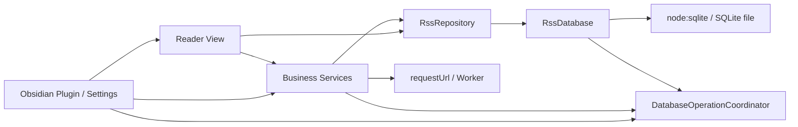
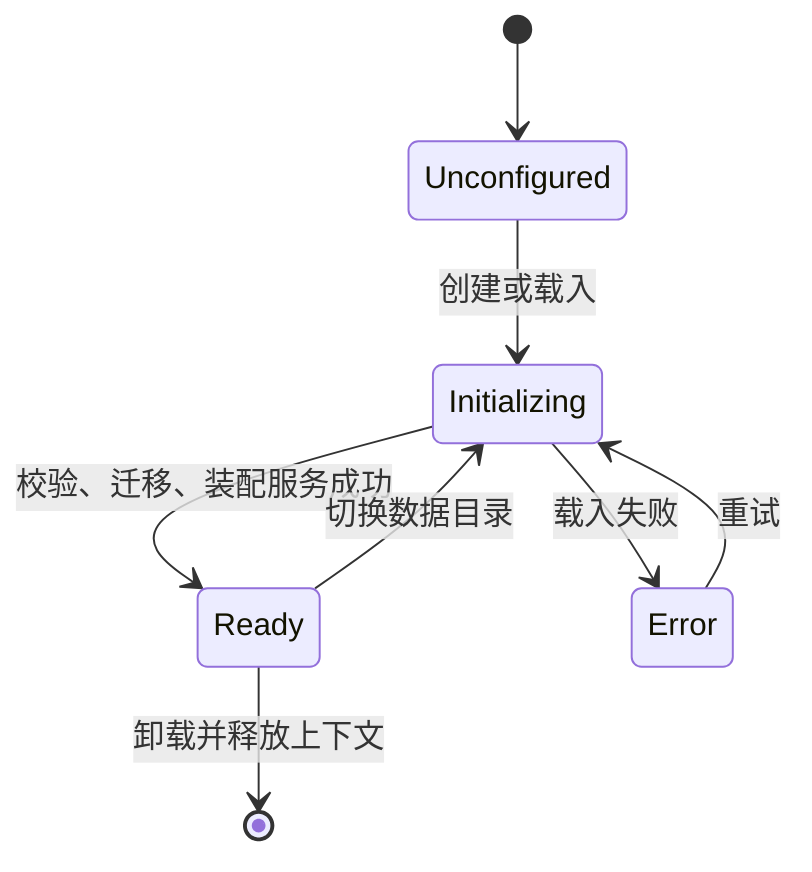

# 架构设计

本文面向维护者，描述 Academic RSS Reader v1.6.0 的当前运行架构。代码、测试和
`src/database/schema.ts` 是最终事实源。

## 总览



依赖方向固定为：

```text
Obsidian 生命周期与 UI
        ↓
业务服务
        ↓
Repository
        ↓
RssDatabase
        ↓
node:sqlite
```

UI 和 Service 不直接执行 SQL；所有业务 SQL 集中在 `RssRepository`。`RssDatabase`
只负责连接、事务、迁移、校验、备份和恢复，不理解订阅或推荐业务。

## 模块职责

| 模块 | 主要职责 | 不应承担 |
|---|---|---|
| `src/main.ts` | 插件生命周期、数据库上下文、服务装配、目录切换 | 业务 SQL、RSS 解析 |
| `src/database/` | SQLite 连接、写队列、schema、迁移、备份恢复 | 页面状态、推荐算法 |
| `src/repositories/` | 唯一 SQL 访问层、领域对象映射、兼容查找 | 网络请求、DOM |
| `src/services/` | Feed、翻译、推荐、LLM 和任务协调 | 直接渲染界面 |
| `src/views/` | 阅读器、订阅管理、分析和局部 UI 更新 | 数据库生命周期 |
| `src/settings/` | 声明式设置、数据目录选择与数据库操作入口 | 保存业务数据 |
| `src/locales/` | 英文事实词典和简体中文翻译 | 模块级缓存翻译结果 |

`ServiceContext` 把一个数据库实例及其 Repository、Feed、Translation、
Recommendation 和 LLM Service 绑定为同一上下文。切换数据库时不能复用旧上下文中的
任何服务。

## 数据库生命周期

插件启动只加载设置并注册 UI，不打开数据库。



载入顺序：

1. 校验 Vault 相对目录，拒绝空路径、绝对路径和 `..` 越界。
2. 通过 `DataAdapter.getFullPath()` 解析 SQLite 的真实路径。
3. 检查 Node.js、`DatabaseSync` 和 SQLite Backup API。
4. 打开数据库，必要时从受控临时文件恢复。
5. 创建新 schema 或按顺序执行 migration。
6. 启用 WAL、外键与完整性检查。
7. 创建 Repository 和各 Service，恢复未完成的翻译任务。

释放上下文内部顺序固定为：

```text
停止 Feed / Recommendation / Translation / LLM
→ 等待当前任务结束
→ database.drain()
→ database.close()
```

Obsidian 的 `onunload()` 接口本身返回 `void`；清理工作由该入口触发，但
`disposeContext()` 内部仍保持以上异步顺序。后台任务必须依靠 generation 检查和操作
协调器，保证迟到响应不再写入已释放上下文。

## 并发与取消

系统使用两层保护：

- `DatabaseOperationCoordinator`：普通后台操作通过 `acquireOperation()` 登记；目录切换
  和恢复通过 `acquireTransition()` 建立互斥边界。
- `RssDatabase.write()`：所有写入进入同一 Promise 写链，并在 `BEGIN IMMEDIATE`
  事务内执行。

Feed、Translation、Recommendation 和 LLM Service 各自维护递增 generation。网络返回、
CPU 阶段和写数据库前都必须检查 generation。`stop()` 会停止接收新任务，并等待当前任务
排空。

## 主要业务流程

### 更新订阅

```text
选择启用订阅
→ 自动更新过滤近期成功与失败退避，手动更新不做近期过滤
→ 按全局 4、同域 1 并发请求
→ 校验 RSS/XML 与链接
→ 解析文献字段和 RSS 原生摘要图 URL，并进行兼容去重
→ 在一个写事务中更新文献和订阅关联
→ 更新健康状态和摘要
→ 过期整理
→ 刷新推荐
→ 刷新界面
```

取消后不得执行过期整理、更新摘要、推荐刷新或全局 UI 刷新。

RSS 原生摘要图只从当前 item 的 media/enclosure/HTML 字段提取。插件不会请求文章页面；
阅读器显示图片时由浏览器直接加载已验证的 HTTP(S) 图片 URL。有图卡片只有内容区与图片区
两个直接分区。

卡片显示设置保存在插件 `data.json`，不进入 SQLite。标题、推荐依据和操作始终显示；期刊、
作者、发表日期、DOI、文本摘要和摘要图分别由布尔设置控制。默认只显示期刊和摘要图，保持
v1.5.0 的外观。设置页使用声明式 toggle，保存时合并刷新所有已打开阅读器。

阅读器根节点根据全局设置切换元数据、作者和摘要布局类，CSS 由固定行槽计算统一卡片高度：
标题三行、元数据一行、作者一行、文本摘要三行和包含相关度/关键词/操作的底行。关闭可选
字段会同时移除对应行槽；单篇字段缺失只留下空槽，不改变该卡片高度。超过三行的标题和摘要
通过固定高度直接裁切，不使用 Chromium `-webkit-line-clamp`；作者与元数据保持单行并提供
完整悬停文本。操作按钮直接紧跟相关度与两行关键词区域，不使用剩余空间推到最右侧。

文本摘要只使用 RSS 原文，不跟随标题翻译。展示投影会保守识别完全由 `Publication date`、
`Source`、`Author(s)`、`DOI` 等标签组成的 metadata-only summary 并隐藏它，但不修改
`items.summary` 或推荐特征。关闭摘要图时不会创建图片 DOM，因此不产生卡片图片请求；
启用时图片区仍受统一卡片高度约束，不参与决定卡片高度。图片元素自身是可点击区域，
激活后通过 Obsidian 模态框放大；图片加载失败只隐藏图片分区或在模态框中显示错误。
全部字段启用时，卡片采用紧凑等高布局：期刊、发表日期和 DOI 在同一元数据行中从左向右
连续排列，不使用期刊字段填充剩余宽度；作者和摘要使用固定标签列与可收缩正文列，保证
中英文界面下正文起点一致。标题、推荐依据、操作区和摘要图的顺序与交互不变。
放大模态框由图片固有尺寸动态决定，小图不强制放大；大图限制在约
`88vw × 84vh` 的内容区域内，同时保留关闭控件和边缘安全距离。
缩略图使用浏览器原生懒加载并复用服务器允许的 HTTP 缓存，不预加载全部图片，也不在 Vault
或 SQLite 中保存图片二进制；因此远程图片尺寸未知不会改变初始卡片布局。

标题默认按纯文本渲染；仅将 `$...$`、`$$...$$`、`\(...\)` 和 `\[...\]` 分隔的片段交给
Obsidian `renderMath()`。首次发现公式时异步调用 `loadMathJax()`；加载完成后只重绘当前
阅读列表的标题，并在同一同步渲染批次结束后调用 `finishRenderMath()`。公式解析失败时只
回退对应片段，不影响其余标题或卡片。该边界避免把普通标题中的 Markdown 符号或 HTML
当作富文本执行，也不让 MathJax 加载阻塞阅读器打开。

OPML 导入只读取 `outline.xmlUrl`（兼容 `outline.url`），忽略 `htmlUrl`。仅当输入不含
`outline` 时才执行纯文本逐行 URL 扫描，避免把期刊网页误导入为订阅。
历史导入产生的 `xmlUrl=""` / `htmlUrl=""` 元数据不会发送条件请求；下一次成功的完整
RSS 响应会用 channel title 修复名称和默认期刊，避免 304 阻止重新解析。修复前，订阅表
优先用已有文章中出现最多的文章级期刊名显示；无法推断时显示订阅域名，不暴露属性碎片。

### 推荐

```text
读取已分类训练样本和未读文献
→ 构建统一 TF-IDF/L2 特征
→ Worker 训练，必要时使用 fallback
→ 验证并选择建议阈值
→ 写入模型、关键词和未读评分
→ 可选 LLM 只复核 pending 文献
```

训练 hash 未变化时复用模型，只对新增或内容变化的未读文献评分。

### 翻译

翻译任务键为 `itemId + field + targetLanguage`。队列写入 pending 状态后调用 Provider，
成功或失败事件只更新目标卡片。源文本 hash 改变时旧译文不复用；失败占位可删除并重试。

### 目录切换与恢复

目录切换先获取 transition、创建当前库保护备份、排空写入，再构建新上下文。只有新上下文
完整可用且设置保存成功后才替换当前上下文。

恢复先停止所有服务并创建 `before-restore` 保护备份，再通过 incoming/rollback 流程替换
数据库；恢复完成后重新初始化翻译队列并恢复服务。

## 文件与网络边界

- 运行数据库与 `backups/` 必须位于用户选择的 Vault 相对目录。
- 原生文件 API 只允许访问 SQLite 主文件、WAL/SHM、受控临时文件和备份。
- 其他 Vault 文件继续使用 `DataAdapter`。
- Feed 与翻译使用 Obsidian `requestUrl()`。
- 文章链接只允许 HTTP(S)。
- LLM 只允许 HTTPS，或 localhost、`127.0.0.1`、`::1` 的本机 HTTP。
- API Key 由 Obsidian SecretStorage 保存，不进入业务数据库。

## 修改影响导航

| 修改目标 | 首要代码 | 同步检查 |
|---|---|---|
| 新增数据库字段或表 | `database/schema.ts` | Repository、迁移测试、数据库文档 |
| 修改文献身份 | `rss-parser.ts`、`rss-repository.ts` | v3 兼容、重复测试、开发文档 |
| 修改订阅调度 | `feed-service.ts`、`feed-scheduling.ts` | 通知文案、取消测试 |
| 修改推荐特征 | `recommendation-service.ts` | `FEATURE_VERSION`、Worker/fallback 一致性 |
| 修改翻译任务 | `translation-service.ts` | 复合缓存键、单卡片事件、语言切换 |
| 修改 LLM | `llm-service.ts` | URL、超时、重试、取消和 prompt 边界 |
| 修改 UI 文案 | `locales/en.ts`、`locales/zh-CN.ts` | `npm run check:i18n` |
| 修改生命周期 | `main.ts`、协调器、各 Service | hanging request 与关闭数据库测试 |

## 架构约束

新增功能时应保持：

1. UI 不直接访问 SQLite。
2. Service 不绕过 Repository 写业务表。
3. 新后台任务必须具备取消、等待排空和数据库切换边界。
4. 新的 Vault 路径先校验相对路径，再解析真实路径。
5. 用户可见文案同时提供英文与简体中文。
6. schema 只能追加 migration，不修改已发布 migration。

数据库表和持久化规则见[数据库设计](DATABASE.md)，命令与发布流程见
[开发说明](DEVELOPMENT.md)。
