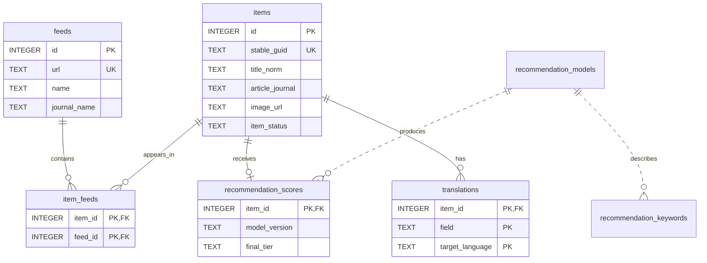

# 数据库设计

本文描述 Academic RSS Reader v1.6.0 的有效 schema 5。schema 事实源为
`src/database/schema.ts`，业务 SQL 事实源为 `src/repositories/rss-repository.ts`。

## 存储位置与运行参数

```text
<Vault>/<dataDirectory>/
├── rss-reader.sqlite3
└── backups/
```

连接使用 `node:sqlite` `DatabaseSync`，运行参数包括：

- `foreign_keys=ON`
- `journal_mode=WAL`
- `busy_timeout=5000`
- 写事务使用 `BEGIN IMMEDIATE`
- 所有写入经过单一写队列

数据库面向单个 Obsidian 桌面实例，不设计为多人或多进程共享写入。

## 关系模型



推荐模型与关键词/评分通过 `model_version` 形成逻辑关系，不使用外键，以允许清理旧模型时
保留当前可解释结果。实际删除和替换由 Repository 在事务中维护。

## 数据所有权

| 数据 | 写入入口 | 主要读取方 |
|---|---|---|
| 订阅、文献、订阅关联、更新摘要 | `FeedService` → `RssRepository` | 阅读器、订阅管理、推荐 |
| 文献阅读状态 | `RssReaderView` → `RssRepository` | 阅读器、推荐、分析 |
| 推荐模型、关键词、评分 | `RecommendationService` → `RssRepository` | 阅读器、推荐管理 |
| LLM 复核结果 | `LlmService` → `RssRepository` | 阅读器 |
| 翻译任务与译文 | `TranslationService` → `RssRepository` | 阅读器 |
| schema、备份、恢复文件 | `RssDatabase` | 插件生命周期与设置页 |

用户设置不存入业务数据库：普通设置由 Obsidian 保存在插件 `data.json`，LLM API Key
保存在 SecretStorage。数据库中不应新增设置页偏好或明文密钥。

## 表设计

### `feeds`

订阅定义、HTTP 条件请求缓存和自动更新健康状态。

| 字段组 | 字段 |
|---|---|
| 身份 | `id`, `url`（唯一） |
| 展示 | `name`, `journal_name`, `enabled` |
| 时间 | `created_at`, `updated_at`, `last_checked_at`, `last_success_at` |
| HTTP 缓存 | `etag`, `last_modified` |
| 健康状态 | `last_error`, `consecutive_failures`, `health_status`, `next_auto_update_at` |

`name` 是订阅名称；`journal_name` 是可编辑的默认期刊名。修改订阅不会批量修改文章。
订阅管理界面只显示并编辑一个期刊字段，保存时同步写入 `name` 与 `journal_name`；保留两个
数据库列仅用于兼容现有 schema、OPML 和更新服务。
读取历史异常 OPML 数据时保留这两个原始字段供更新服务识别和自动修复；UI 的派生显示值
优先采用该订阅已有文章中出现最多的 `article_journal`，无法推断时回退到订阅 URL 域名。

### `items`

全局去重后的文献主体。

| 字段组 | 字段 |
|---|---|
| 身份 | `id`, `stable_guid`（唯一）, `title_norm`, `doi`, `link` |
| 原始内容 | `title`, `authors`, `article_journal`, `year`, `pub_date`, `summary`, `image_url` |
| 状态 | `item_status` |
| 观察时间 | `first_seen_at`, `last_seen_at` |

`item_status` 的领域值为 `unread`、`interested`、`archived`、`hidden`、`expired`。
`article_journal` 只保存 RSS 明确提供的文章级期刊，不保存订阅默认值。

展示期刊在查询时派生：

1. 文章级 `article_journal`；
2. 若文章级值为空，使用按 `item_feeds.first_seen_at`、`feeds.id` 排序后的第一个非空
   `feeds.journal_name`。

卡片始终只显示一个期刊名。订阅更新提供新的非空文章级期刊时会刷新
`article_journal`；空值不会覆盖已有文章级期刊。

### `item_feeds`

文献与订阅的多对多关联，复合主键为 `(item_id, feed_id)`。

- 两个外键均启用 `ON DELETE CASCADE`。
- `first_seen_at` 表示首次从该订阅观察到文献。
- `last_seen_at` 表示最近一次仍在该订阅中出现。
- 删除订阅后，Repository 额外清理没有任何订阅关联的孤立文献。

### `recommendation_scores`

每篇文献最多一条当前推荐结果，主键和外键均为 `item_id`。

- 本地模型：`keyword_score`, `keyword_tier`, `matched_keywords`。
- 最终结果：`final_tier`。
- LLM 覆盖：`llm_tier`, `llm_error`, `llm_reviewed_at`。
- 可追溯性：`model_version`, `content_hash`, `scored_at`。

重新进行本地评分会清除旧 LLM 覆盖，避免基于旧内容的 LLM 结果继续生效。

### `recommendation_keywords`

当前模型的词项、IDF、自动权重和正负样本出现数。主键为 `keyword`。

`is_disabled` 是当前唯一人工控制字段。`manual_direction` 和 `manual_weight` 仅为旧 schema
兼容保留，推荐计算不读取它们。

完整字段为 `keyword`、`auto_weight`、`positive_count`、`negative_count`、
`manual_direction`、`manual_weight`、`is_disabled`、`model_version`、`updated_at` 和
`idf`。模型替换时删除未停用的旧词项，保留人工停用项。

### `recommendation_models`

推荐训练运行记录，主键为 `model_version`。

保存样本数量、截距、训练 hash、验证准确率、建议阈值、`feature_version` 和错误状态。
按 `created_at DESC, rowid DESC` 选择最新模型，只保留最近 10 条。

完整字段为 `model_version`、`positive_count`、`negative_count`、`unread_count`、
`created_at`、`error_message`、`intercept`、`training_hash`、`validation_accuracy`、
`suggested_low_threshold`、`suggested_high_threshold` 和 `feature_version`。

### `translations`

翻译任务与缓存，复合主键为：

```text
(item_id, field, target_language)
```

`field` 只允许 `title` 或 `abstract`；`status` 只允许 `pending`、`translating`、
`succeeded`、`failed`。`source_hash` 防止源文本变化后复用旧译文。

其他字段包括 `source_text`、`translated_text`、`source_language`、`provider`、
`attempt_count`、`last_error` 和 `translated_at`。

数据库打开时会把遗留的 `translating` 重置为 `pending`，由 Translation Service 恢复队列。

### `app_metadata`

轻量键值元数据，不存用户设置。目前包括：

- `last_update_summary`：最近一次实际执行的订阅更新摘要。
- `legacy_identity_repair_v3`：旧身份兼容整理是否已完成。

新增 key 时需要在代码和本文说明用途、写入方和失效条件。

### `schema_migrations`

记录已应用 schema 版本和时间。当前最新版本为 4。`PRAGMA user_version` 同步写入，但迁移
判断以 `schema_migrations` 为主。

## 索引

| 索引 | 用途 |
|---|---|
| `idx_items_title_norm` | 标题兼容查找 |
| `idx_items_status` | 五篮子过滤 |
| `idx_items_doi` | DOI 去重 |
| `idx_items_link` | 链接兼容查找 |
| `idx_items_identity_fallback` | 标题、作者、年份身份查找 |
| `idx_items_identity_fallback_journal` | 无强身份时增加期刊限定 |
| `idx_item_feeds_feed` | 按订阅查询文献 |
| `idx_recommendation_scores_tier` | 推荐层级过滤 |
| `idx_translations_status` | 恢复待处理翻译任务 |

新增高频查询前先检查现有索引；索引变化必须通过 migration 追加。

## 文献身份与兼容查找

新抓取文献生成稳定身份的优先级：

```text
DOI
→ 标题 + 年份 + 作者
→ 出版商稳定 ID（如 ScienceDirect PII）
→ 标题 + 年份 + 派生期刊
```

入库时不是只比较新 `stable_guid`，还依次使用：

1. 完全相同的 `stable_guid`；
2. DOI；
3. 规范化链接与标题；
4. URL、出版商 ID、标题/作者/年份和期刊的兼容候选。

只有候选唯一且没有强身份冲突时才复用旧记录。双方都有不同 PII 时禁止弱合并。命中旧记录
后保留原 `id`、`stable_guid` 和阅读状态，并用 `COALESCE(NULLIF(...))` 只补充非空字段。

这套兼容层用于解决 v3 升级后第一次更新时 RSS 字段变化造成的重复，不能随意删除。

## Schema 迁移

新数据库先执行版本 1 基线，再按 `SCHEMA_MIGRATIONS` 依次应用 2、3、4、5。已有数据库只执行
尚未登记的版本。

每个 migration：

1. 使用 `BEGIN IMMEDIATE`；
2. 顺序执行全部语句；
3. 写入 `schema_migrations`；
4. 成功后提交，失败则回滚。

schema 4 的主要变化：

- `feeds.journal_name`；
- `items.journal` 重命名为 `items.article_journal`；
- 旧订阅名回填为默认期刊；
- 清空旧文章期刊值，由订阅关联重新派生展示；
- 增加 DOI、link 和身份组合索引。

schema 5 的主要变化：

- 增加可空的 `items.image_url`，保存 RSS item 提供的 HTTP(S) 摘要图 URL；不保存图片二进制。
- 旧文章不回填图片，后续订阅更新发现图片时才更新对应文献。
- 无图值写入 `NULL`；订阅更新会把同一订阅历史遗留的空字符串规范化为 `NULL`。

升级前通过 `VACUUM INTO` 在 `backups/` 创建对应版本的 `before-schema*` 快照。迁移失败时恢复该
快照。已发布 migration 不得修改、删除或重排；下一次变更应提高 `SCHEMA_VERSION` 并追加
新 migration。

## 备份、恢复与异常恢复

### 手动与保护备份

`RssDatabase.backup()` 先排空写队列，再调用 SQLite Backup API。完成后执行完整性与外键
检查；无效备份会被删除。

保护备份前缀包括：

- `before-schema*`：schema 迁移前；
- `before-switch-*`：切换数据目录前；
- `before-restore-*`：恢复前；
- `manual-*`：用户手动创建。

### 恢复

```text
备份源
→ SQLite Backup API 写入 .incoming
→ 校验 incoming
→ WAL checkpoint 并关闭当前连接
→ 当前库改名为 .rollback
→ incoming 安装为正式库并校验
→ 成功删除 rollback；失败恢复 rollback
```

恢复和切换期间由 `DatabaseOperationCoordinator` 阻止后台任务进入。

### 启动异常恢复

正式库无效时只检查受控候选：

- `.tmp`
- `.previous`
- `.incoming`
- `.rollback`

候选必须通过完整校验才能替换正式库。无法恢复时保留可诊断状态并要求用户从备份恢复，不会
创建独立“恢复数据库”继续运行。

## 修改 schema 的维护清单

1. 提高 `SCHEMA_VERSION`，只追加 migration。
2. 更新本文件中的表、字段、索引和关系。
3. 更新 Repository 类型映射与全部 SQL。
4. 增加“旧版数据库 → 新版”的迁移测试。
5. 验证迁移失败回滚、WAL 重开、备份恢复和外键检查。
6. 验证大数据量下的写入、列表查询与关闭重开。
7. 确认发布说明只保留用户需要知道的升级影响，不复制本文件的实现细节。

架构和生命周期见[架构设计](ARCHITECTURE.md)。
